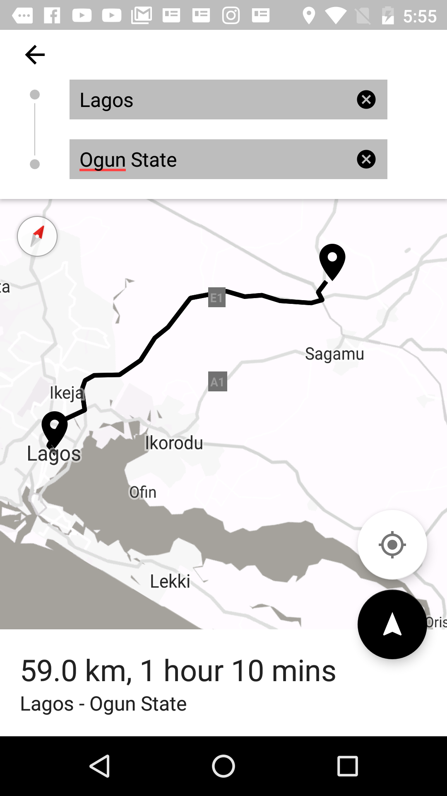
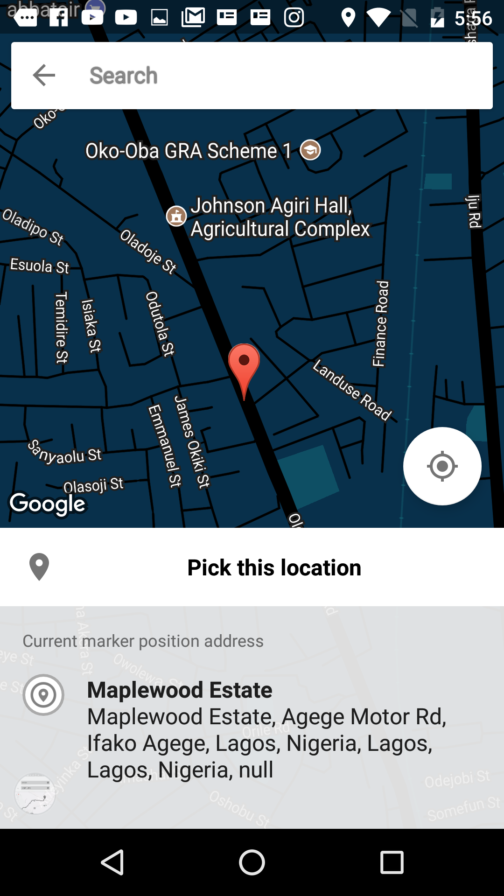
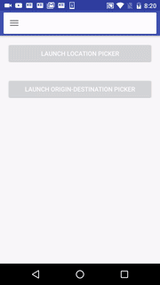
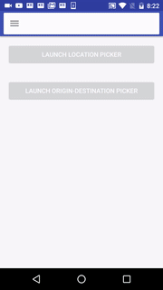

Nibo library for Android
====================================

[](https://jitpack.io/#aliumujib/Nibo)


Android library that provides UI for a customizable place picker, origin and destination picker and Google Places autocomplete searchview

Current stable version - 2.0
---------------

**This version uses Google Play Services 11.6.0 and RxJava 2.0.+**

What can you do with this?
--------------------------
* Easily add a Google Places autocomplete searchview widget to your project
* Pick a location from a map
 - Can be customized to match the theme of your app
 - Can use customized map markers
 - Can drag map marker to select location
 - Can search for location names
 - uses a fragment which you can overide and add extra functionality
* Pick a origin location and a destination location (like Uber)
 - Can be customized to match the theme of your app
 - Can use custom map markers for each location
* Get directions, distance and time from a location with directions API

What does the UI look like?
----------------------------
|       ROW 1  |        ROW 2    |   
| ------------- |:-------------:|
|     |  |
|     |  |
|  |  |


How do I use this?
----------------------------
#### Using NiboPlaceAutoCompleteSearchView
Simple. All you need is to do is:
- Add the following to your layout (You can change the values as you wish)

```xml
<com.alium.nibo.autocompletesearchbar.NiboPlacesAutoCompleteSearchView
       android:id="@+id/autocompletesearchbar"
       android:layout_width="match_parent"
       android:layout_height="wrap_content"
       android:elevation="4dp"
       app:niboSV_customToolbarHeight="?attr/actionBarSize"
       app:niboSV_displayMode="screen_toolbar"
       app:niboSV_editHintText="Search"
       app:niboSV_editHintTextColor="#757575"
       app:niboSV_editTextColor="#757575"
       app:niboSV_homeButtonMode="nibo_burger"
       app:niboSV_searchCardElevation="2dp"
       app:niboSV_searchTextColor="#757575" />
```
- In your fragment or activity, implement ```NiboAutocompleteSVProvider```, and return a valid GoogleAPIClient object and an instance of NiboPlacesAutoCompleteSearchView.SearchListener (see example app for better explanation)

- Call setmProvider(this) on your seachview.


#### Using NiboOriginDestinationPickerUI
- Add the following to your manifest file. NiboOrigDestTheme.NoActionBar gives you the default (white and black) styling.

```xml
<activity
           android:name="com.alium.nibo.origindestinationpicker.NiboOriginDestinationPickerActivity"
           android:label="@string/title_activity_origin_destination_picker"
           android:theme="@style/NiboOrigDestTheme.NoActionBar" />

```

- To use a custom style, see *NiboActivityStyle* style in the niboexample project. Make sure your theme has NiboOrigDestTheme.NoActionBar as a parent.

- To start the activity:

```java
Intent intent = new Intent(this, NiboOriginDestinationPickerActivity.class);

        NiboOriginDestinationPickerActivity.NiboOriginDestinationPickerBuilder config = new NiboOriginDestinationPickerActivity.NiboOriginDestinationPickerBuilder()
                .setDestinationMarkerPinIconRes(R.drawable.ic_map_marker_black_36dp)
                .setOriginMarkerPinIconRes(R.drawable.ic_map_marker_black_36dp)
                .setOriginEditTextHint("Input pick up location")
                .setPrimaryPolyLineColor(R.color.colorPrimary)
                .setSecondaryPolyLineColor(R.color.colorAccent)
                .setDestinationEditTextHint("Input destination")
                .setStyleEnum(NiboStyle.SUBTLE_GREY_SCALE);

        NiboOriginDestinationPickerActivity.setBuilder(config);
        startActivityForResult(intent, REQUEST_CODE);
```

- You can customize it other things like the directions Polyline color using the NiboOriginDestinationPickerBuilder as shown above.


#### Using NiboPlacePickerUI
- To start the activity:

```java
Intent intent = new Intent(this, NiboPlacePickerActivity.class);
 NiboPlacePickerActivity.NiboPlacePickerBuilder config = new NiboPlacePickerActivity.NiboPlacePickerBuilder()
         .setSearchBarTitle("Search for an area")
         .setConfirmButtonTitle("Pick here bish")
         .setMarkerPinIconRes(R.drawable.ic_map_marker_black_36dp)
         .setStyleEnum(NiboStyle.NIGHT_MODE);
         .setStyleFileID(R.raw.retro);
 NiboPlacePickerActivity.setBuilder(config);
 startActivityForResult(intent, REQUEST_CODE);
```

- To retrieve the results:

```java
Intent intent = new Intent(this,
        if (resultCode == Activity.RESULT_OK && requestCode == 300) {
            NiboSelectedPlace selectedPlace = data.getParcelableExtra(NiboConstants.SELECTED_PLACE_RESULT);
            Toast.makeText(this, selectedPlace.getPlaceAddress(), Toast.LENGTH_LONG).show();

            Toast.makeText(this, selectedPlace.getLatitude(), Toast.LENGTH_LONG).show();

              Toast.makeText(this, selectedPlace.getLongitude(), Toast.LENGTH_LONG).show();
        } else if (resultCode == Activity.RESULT_OK && requestCode == 200) {
            NiboSelectedOriginDestination selectedOriginDestination = data.getParcelableExtra(NiboConstants.SELECTED_ORIGIN_DESTINATION_RESULT);
            Toast.makeText(this, selectedOriginDestination.getOriginFullName() + " - " + selectedOriginDestination.getDestinationFullName(), Toast.LENGTH_LONG).show();
        } else {
            Toast.makeText(this, "Error getting results", Toast.LENGTH_LONG).show();
        }

```

- You can customize it other things like the directions Polyline color using the NiboPlacePickerBuilder as shown above.


How to add to your project?
--------------
### Gradle
**Step 1.** Add the JitPack repository to your build file

Add it in your root `build.gradle` at the end of repositories:

```groovy
allprojects {
    repositories {
        ...
        maven { url 'https://jitpack.io' }
    }
}
```

**Step 2.** Add the dependency

```groovy
dependencies {
     compile 'com.github.aliumujib:Nibo:2.0'
}
```

Nibo requires at minimum Android 4.1 (API Level 15).

### Manual
- download project source
- import new module to your project
- compile path(":modulename")

Sample
------
Sample usage is available in *niboexample* directory.

Directions, Places and Maps APIs require API Key. Before running samples you need to create project on API console
and obtain API Key from [here](https://developers.google.com/places/android/signup).
Obtained key should used to replace string named: ```google_places_key``` in ```google_maps_api.xml``` file.

TODO
------
- Add better example
- Add options transport type to DirectionsFinder

References
------

If you need the SearchView without all the Google Places stuff, look at [PersistentSearchView ](https://github.com/crysehillmes/PersistentSearchView).

Other Notes
------
Nibo means “Where?” in my native language (Yoruba), so yeah, Nigeria to the world baby!!
Also Nibo is a work in progress and I will keep updating it, suggestions (and issues) are welcome. Tweet them at me @aliumujib on twitter or email me.
